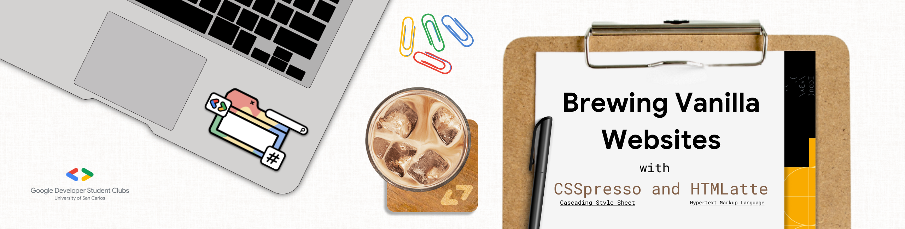

# GDSC Brewing Vanilla Websites



> A workshop designed for GDSC members to master the art of creating stunning websites using HTML and CSS. Enhance your web development skills with us!

## Installation

This requires you to have [git](https://git-scm.com/downloads) and [Visual Studio Code](https://code.visualstudio.com/download) so that you can use the `git` and `code` commands.

```bash
git clone https://github.com/Luzefiru/gdsc-brewing-vanilla-websites.git &&
cd gdsc-brewing-vanilla-websites &&
git checkout 0-start &&
code .
```

## Tools of the Trade

- [Visual Studio Code](https://code.visualstudio.com/download)
  - Integrated Development Environment
  - install the language plugins recommended when prompted
- [Live Server](https://marketplace.visualstudio.com/items?itemName=ritwickdey.LiveServer)
  - instantly spin-up the current directory as a website server locally
- [Figma](https://www.figma.com/signup)
  - collaborative design tool for designing, prototyping, and sharing websites
- [Chromium-based Web Browser](https://www.google.com/intl/en_ph/chrome/)
  - comes with Development Tools built-in for debugging

> Time to setup our IDE...

## HyperText Markup Language _(HTML)_

- HTML
  - the necessary boilerplate
- The Box Model
- HTML Forms

**Go beyond**

- HTML Form Validation
- Semantic HTML
- Accessibility (a11y)
  - Web Content Accessibility Guidelines (WCAG)
  - Web Accessibility Initiative - Accessible Rich Internet Applications (WAI-ARIA)
- Search Engine Optimization (SEO)

### Resources

- [HTML Cheatsheet & Boilerplate Code](https://htmlcheatsheet.com/)
- [MDN Client-side form validation](https://developer.mozilla.org/en-US/docs/Learn/Forms/Form_validation)

## Cascading Style Sheets _(CSS)_

- CSS
  - CSS Selectors
  - CSS Pseudo-class
- CSS Flexbox
- CSS Grid
- CSS Transitions

**Go beyond**

- Responsive Web Design
  - Media Queries
- CSS Keyframes

#### Resources

- [InternetingIsHard: Flexbox Guide](https://www.internetingishard.com/html-and-css/flexbox/)
- [Visual Guide to CSS Grid](https://webkit.org/blog/7434/css-grid-layout-a-new-layout-module-for-the-web/)
- [Compare CSS Transitions](https://www.cssportal.com/css-cubic-bezier-generator/)
- [YouTube Video on CSS Transitions](https://www.youtube.com/watch?v=8kK-cA99SA0)

## Project Showcase

> **Final Project**
>
> Bring this [this Figma File](https://www.figma.com/file/gzS39Xf8dKuAhxLpnUvcte/GDSC-Brewing-Vanilla-Websites-with-Ian-de-Jesus?type=design&node-id=0%3A1&mode=design&t=a6vqTg5YgwYN9k2W-1) into life with Vanilla HTML & CSS.
>
> - assets can be downloaded straight from the document.
> - the `font-family` is a free typeface [from Google Fonts called Inter](https://fonts.google.com/specimen/Inter).

# References

- [Roadmap.sh: Frontend Developer](https://roadmap.sh/frontend)
- [TheOdinProject: Foundations Course](https://www.theodinproject.com/paths/foundations/courses/foundations)
